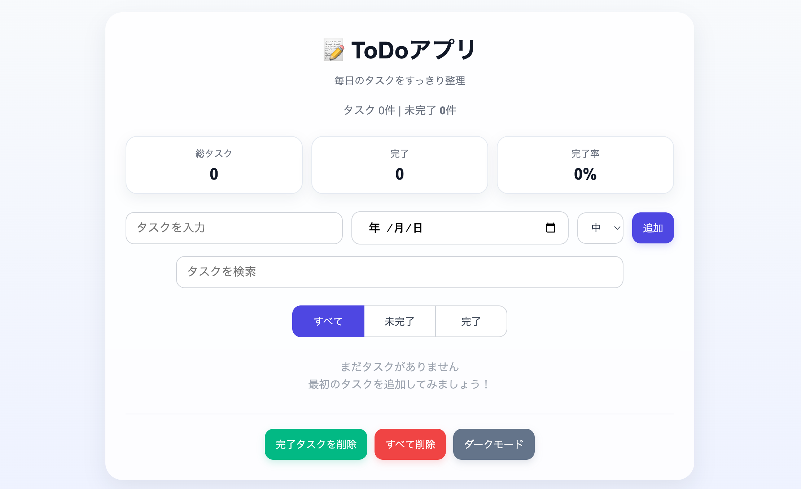
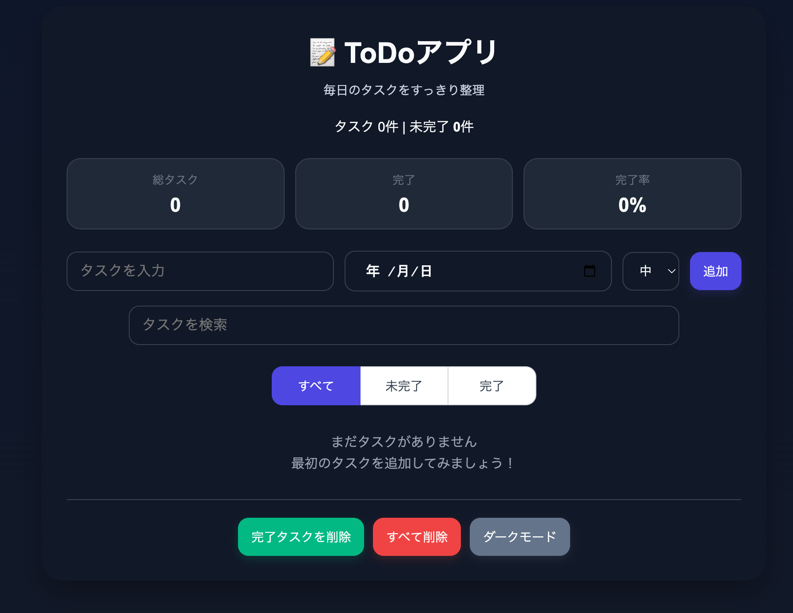

# Todo App

JavaScriptで作成したシンプルなTodoアプリです。
タスクの追加・編集・削除・期限管理などを行うことができます。

---

## Demo

https://rikusugihara.github.io/todo-app/

---

## Screenshot

### Light Mode

### Dark Mode

---

## Features

・タスク追加
・タスク編集
・タスク削除
・完了チェック

・期限設定
・優先度設定

・タスク検索
・タスクフィルター（すべて/未完了/完了）

・ドラッグ&ドロップ並び替え

・ダークモード

・タスク統計表示

・localStorage保存

---

## Tech Stack

- HTML
- CSS
- JavaScript
- localStorage

---

## Usage

1. タスクを入力して追加
2. チェックを入れると完了
3. フィルターで表示切り替え
4. ドラッグで並び替え

---

## Future Improvements

・期限通知機能
・カテゴリ機能
・レスポンシブデザイン改善

---

## Author

GitHub
https://github.com/rikusugihara
