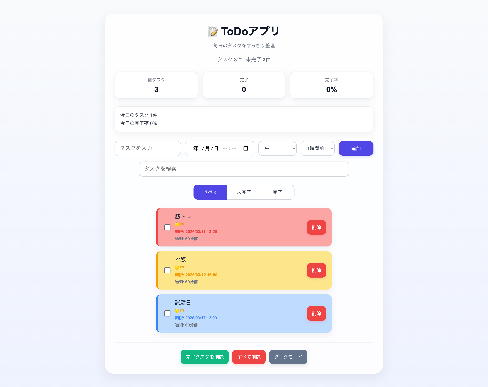
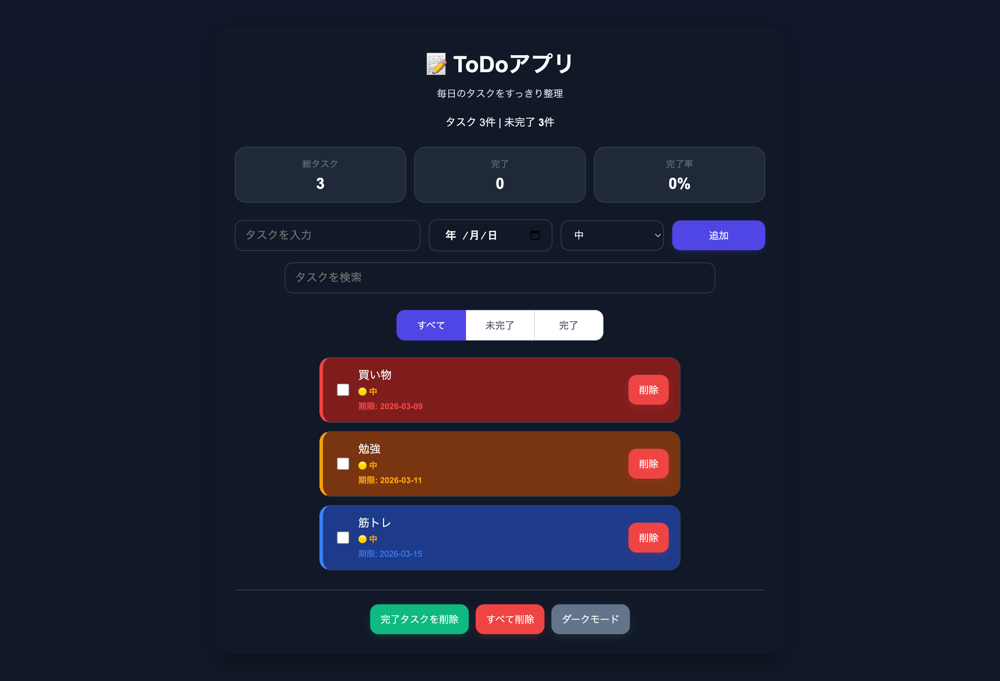

# 📝 Todo App

毎日のタスクを整理できるシンプルなToDoアプリです。
ブラウザだけで動作し、PWAとしてインストールすることもできます。

---

## デモ

https://rikusugihara.github.io/todo-app/

---

## スクリーンショット

### Light Mode

### Dark Mode

---

## 主な機能

- タスク追加　/ 削除
- 完了チェック
- タスク検索
- フィルター（すべて / 未完了 / 完了）
- 優先度設定
- 統計表示
- ドラッグ＆ドロップ並び替え
- ダークモード
- レスポンシブデザイン
- PWA対応（インストール可能）
- オフライン対応

---

## 使用技術

- HTML
- CSS
- JavaScript（Vanilla JS）
- localStorage
- Service Worker
- GitHub Pages

---

## PWA対応

このアプリはPWAとしてインストールできます。

Chromeの場合：

1. サイトを開く
2. 「アプリをインストール」ボタンを押す
3. アプリとして起動できます

---

## 今後の改善予定

- タスクのカテゴリ機能
- タスクの通知機能
- UIアニメーションの追加
- データエクスポート機能

---

## 作者

GitHub
https://github.com/rikusugihara
